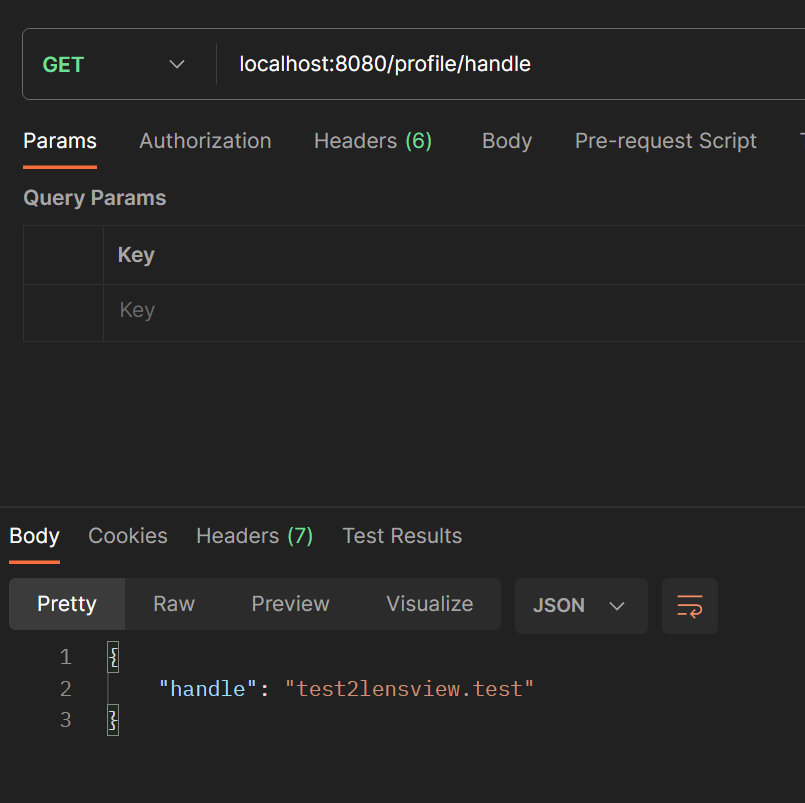
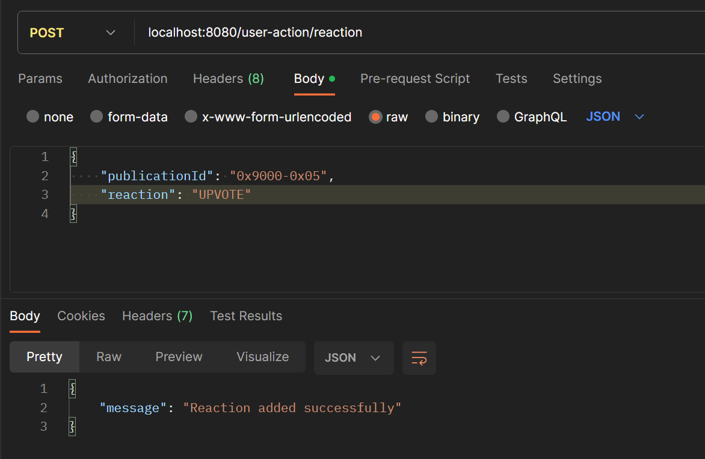
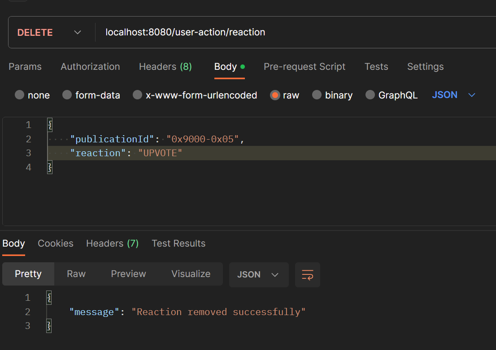

# Basic Lens Protocol Nodejs App

This repo help you set up basic Lens Protocol Nodejs App which uses Lens Protocol GraphQL API
for fetching/mutating data on Lens Protocol, also setup your own REST API using Express.

## Prerequisites

First setup basic typescript nodejs application
using [basic-ts-express-app](https://github.com/anjaysahoo/basic-ts-express-app) repo

## Things that will be covered in this guide are

1. Creating a **simple GET REST API** for fetching data from Lens Protocol
2. **Setting up Prettier with ESLint**
3. **Setting up Husky**
4. Creating a **simple POST/DELETE REST API** for mutating data from Lens Protocol
5. Setting Up Codegen for Lens GraphQL

<details>
 <summary style="font-size: x-large; font-weight: bold">Simple GET REST API</summary>

In this simple example, we will fetch handle for hardcoded app address from Lens Protocol API

### Step-1:

Creating a`Base Client` using [URQL](https://formidable.com/open-source/urql/docs/basics/core/) for all sorts of
fetching related stuff from Lens Protocol.

Under `utils/lens-protocol` folder create a `base-client.ts` file

<b>Note: </b> Rationale behind using `URQL` client can be understood from this
article [5 GraphQL clients for JavaScript and Node.js](https://blog.logrocket.com/5-graphql-clients-for-javascript-and-node-js/#:~:text=GraphQL-based%20servers%20can%20only,a%20GraphQL%20client%20is%20needed.)

### Step-2

Create a `profile-route` route

```typescript
// app.ts
app.use("/profile", profileRoutes);
```

```typescript
// routes/profile.route.ts

import { Request, Response, NextFunction } from "express";
import baseClientUtil from "../utils/lens-protocol/base-client.util";
import getDefaultProfileGraphql from "../graphql/get-default-profile.graphql";
import { APP_ADDRESS } from "../config/env.config";

/**
 * Get the handle.
 *
 * @param req - The request object.
 * @param res - The response object.
 * @param _next - The next function.
 * @returns The handle object.
 */
export const getHandle = async (
  req: Request,
  res: Response,
  _next: NextFunction
) => {
  const response = await baseClientUtil
    .query(getDefaultProfileGraphql, { address: APP_ADDRESS })
    .toPromise();

  res.status(200).json({
    handle: response?.data?.defaultProfile.handle
  });
};
```

### Step-3

Create `profile.controller.ts` file

```typescript
import { Request, Response, NextFunction } from "express";
import baseClientUtil from "../utils/lens-protocol/base-client.util";
import getDefaultProfileGraphql from "../graphql/get-default-profile.graphql";
import { APP_ADDRESS } from "../config/env.config";

/**
 * Get the handle.
 *
 * @param req - The request object.
 * @param res - The response object.
 * @param _next - The next function.
 * @returns The handle object.
 */
export const getHandle = async (
  req: Request,
  res: Response,
  _next: NextFunction
) => {
  const response = await baseClientUtil
    .query(getDefaultProfileGraphql, { address: APP_ADDRESS })
    .toPromise();

  res.status(200).json({
    handle: response?.data?.defaultProfile.handle
  });
};
```

### Step-4

Create models & utility function as per the requirement.

### Testing API



</details>

<details>
 <summary style="font-size: x-large; font-weight: bold">Setup Prettier with ESLint</summary>

### Step-1:

Refer this article to setup prettier 👉
[How to use Prettier with ESLint and TypeScript in VSCode](https://khalilstemmler.com/blogs/tooling/prettier/)

### Step-2:

Refer this article to setup ESLint 👉
[How to use ESLint with TypeScript](https://khalilstemmler.com/blogs/typescript/eslint-for-typescript/)

#### Note:

You start getting `unused error` once you run script `npm run lint` in files like `app.ts`

```typescript
app.use((err: Error, req: Request, res: Response, next: NextFunction) => {
  res.status(404).json({ message: err.message });
});
```

As next is not used so ESLint throw `unused error`, but if you remove next then you will not get others error.

To resolve this you add new rules in `.eslintrc`

```json
{
  "root": true,
  "rules": {
    "_comment": "Below rule help us ignore any unused variables error thrown by eslint",
    "@typescript-eslint/no-unused-vars": [
      "error",
      {
        "argsIgnorePattern": "^_",
        "varsIgnorePattern": "^_",
        "caughtErrorsIgnorePattern": "^_"
      }
    ]
  }
}
```

<b>After this you always define any unused variable in your code, by starting variable name with underscore</b>

Example:

```typescript
app.use((err: Error, req: Request, res: Response, _next: NextFunction) => {
  res.status(404).json({ message: err.message });
});
```

</details>

<details>
 <summary style="font-size: x-large; font-weight: bold">Setting Up Husky</summary>

Husky to prevent bad git commits and enforce code standards in your project.

To understand more about husky, refer to this article
👉 [Enforcing Coding Conventions with Husky Pre-commit Hooks](https://khalilstemmler.com/blogs/tooling/enforcing-husky-precommit-hooks/)

<b>Note: </b>Above article setup is old so follow below steps to set up husky

### Step-1

```sh
npx husky-init && npm install
```

**Note:** Above command may not work in powershell, so try running it in cmd or git bash

### Step-2

```sh
npx husky set .husky/pre-commit "npm run prettier-format && npm run lint"
```

This adds script in `.husky\pre-commit`, which will ensure your code is formatted and linted before committing

After this when ever anyone will try to commit then husky will run script `npm run prettier-format && npm run lint`

Referred resources

1. https://www.youtube.com/watch?v=ZXW6Jn6or1w
2. https://typicode.github.io/husky/getting-started.html

### Below are things to expect after this:-

1. If any file contains prettier then those will be fixed, and **you need to commit that fixed code again**.
2. Issue related to linting will be reported, and **you need fix then only you can commit the code**

**Note:** For setting up Husky for project where are there are app/projects in sub-folders, follow
this [StackOverflow thread](https://stackoverflow.com/questions/74129312/how-to-configure-husky-when-git-is-in-a-different-folder)

</details>

<details>
 <summary style="font-size: x-large; font-weight: bold">Setting Up Environment Variables</summary>

### Step-1

```shell
npm install dotenv
```

### Step-2

Create a `.env` file in the root of your project

### Step-3

Create a `src\config\env.config.ts` file. We will use this file to get our environment variables.

This help reduce code duplication.

```typescript
import dotenv from "dotenv";

dotenv.config();

export const APP_ADDRESS = process.env.APP_ADDRESS as string;
export const PRIVATE_KEY = process.env.PRIVATE_KEY as string;
```

Refer this article
👉 [Node.js Everywhere with Environment Variables!](https://medium.com/the-node-js-collection/making-your-node-js-work-everywhere-with-environment-variables-2da8cdf6e786)
for better understanding

</details>

<details>
 <summary style="font-size: x-large; font-weight: bold">Simple POST/DELETE REST API</summary>

In this simple example, we will be posting and deleting reaction for a post through
Lens Protocol GraphQL API

### Step-1:

Create a `Authenticated Client` using [URQL](https://formidable.com/open-source/urql/docs/basics/core/) for all sorts of
mutation-related stuff from Lens Protocol.

Under `utils/lens-protocol` folder create a `authenticated-client.util.ts` file.

### Step-2

Create a `user-action` route

```typescript
// app.ts
app.use("/user-action", userActionRoute);
```

```typescript
// routes/user-action.ts

import express from "express";

import {
  addReaction,
  removeReaction
} from "../controllers/user-action.controller";

const router = express.Router();

// POST /user-action/reaction
router.post("/reaction", addReaction);

// DELETE /user-action/reaction
router.delete("/reaction", removeReaction);

export default router;
```

### Step-3

Create `user-action.controller.ts` file

```typescript
import { Request, Response, NextFunction } from "express";
import { ReactionRequestBodyModel } from "../models/request-bodies/reaction.request-body.model";
import {
  addReactionToAPost,
  removeReactionFromAPost
} from "../utils/lens-protocol/update-reaction-for-post.util";

/**
 * Adds a reaction to a post.
 *
 * @param req - The request object containing the publication ID and reaction.
 * @param res - The response object.
 * @param _next - The next function.
 */
export const addReaction = async (
  req: Request<unknown, unknown, ReactionRequestBodyModel>,
  res: Response,
  _next: NextFunction
) => {
  try {
    // Call the function to add the reaction to the post
    await addReactionToAPost(req.body.publicationId, req.body.reaction);

    res.status(200).json({
      message: "Reaction added successfully"
    });
  } catch (error) {
    res.status(503).json({
      message:
        "Could not add reaction to publication id: " + req.body.publicationId
    });
  }
};

/**
 * remove a reaction from a post.
 *
 * @param req - The request object containing the publication ID and reaction.
 * @param res - The response object.
 * @param _next - The next function.
 */
export const removeReaction = async (
  req: Request<unknown, unknown, ReactionRequestBodyModel>,
  res: Response,
  _next: NextFunction
) => {
  try {
    // Call the function to remove the reaction from a post
    await removeReactionFromAPost(req.body.publicationId, req.body.reaction);

    res.status(200).json({
      message: "Reaction removed successfully"
    });
  } catch (error) {
    res.status(503).json({
      message:
        "Could not remove reaction from publication id: " +
        req.body.publicationId
    });
  }
};
```

### Step-4

Create models & utility function as per the requirement.

### Testing API

**POST**



**DELETE**



### Referred Resource

1. [ChatGPT Thread](https://chat.openai.com/share/6d227e08-d64c-43d8-8289-7016dd7f0bab) on API structuring.
2. 
3. 

</details>

<details>
 <summary style="font-size: x-large; font-weight: bold">Setting Up Codegen for Lens GraphQL</summary>
 Using codegen we will be able to make Lens Graphql responses type safe.

### Step-1

1. `npm i graphql`
2. `npm i -D typescript @graphql-codegen/cli`
3. `npm i -D @parcel/watcher` to watch your code changes and codegen automatically
4. Add script `"codegen": "graphql-codegen --watch"` to `package.json`
5. `npm i`

### Step-2

Add `src/gql` folder in `.gitignore` & `.eslintignore` as these are dev dependencies and can
be generated during development

### Step-3

`codegen.ts` file

```typescript
import type { CodegenConfig } from "@graphql-codegen/cli";

const config: CodegenConfig = {
  schema: "https://api-mumbai.lens.dev/",
  documents: ["src/graphql/*.ts"], //from where to pick queries & mutations
  ignoreNoDocuments: true, // for better experience with the watcher
  generates: {
    "./src/gql/": {
      //where to put generated code
      preset: "client",
      plugins: []
    }
  }
};

export default config;
```

### Step-4

Below is an example on how to use codegen

1. In `src/graphql/get-default-profile-query.graphql.ts` file

```typescript
import { graphql } from "../gql";

const getDefaultProfileByAddressQuery = graphql(/* GraphQL */ `
  query defaultProfile($address: EthereumAddress!) {
    defaultProfile(request: { ethereumAddress: $address }) {
      id
      name
      isDefault
      metadata
      handle
      picture {
        ... on MediaSet {
          original {
            url
          }
        }
      }
      ownedBy
    }
  }
`);

export default getDefaultProfileByAddressQuery;
```

2. In `src/controllers/profile.controller.ts` file

```typescript
import { Request, Response, NextFunction } from "express";
import baseClientUtil from "../utils/lens-protocol/base-client.util";
import { APP_ADDRESS } from "../config/env.config";
import getDefaultProfileByAddressQuery from "../graphql/get-default-profile-query.graphql";

/**
 * Get the handle.
 *
 * @param req - The request object.
 * @param res - The response object.
 * @param _next - The next function.
 * @returns The handle object.
 */
export const getHandle = async (
  req: Request,
  res: Response,
  _next: NextFunction
) => {
  const response = await baseClientUtil
    .query(getDefaultProfileByAddressQuery, { address: APP_ADDRESS })
    .toPromise();

  res.status(200).json({
    handle: response.data?.defaultProfile?.handle
  });
};
```

3. Run `npm run codegen`

Here `response` variable will contain all types that are there in a query with complete type safety

### Note

You might not get intellisense in some scenario like when UINION like `MediaSet` are used

Like `response.data?.defaultProfile?.picture?.original?.url` IDE will throw error

```text
TS2339: Propert original does not exist on type
{   __typename?: "MediaSet" | undefined;   original: {     __typename?: "Media" | undefined;     url: any;   }; } | {   __typename?: "NftImage" | undefined; }
Property  original  does not exist on type  { __typename?: "NftImage" | undefined; }
```

To resolve this, you can write this in two way

1. Long way

```typescript
if (response.data?.defaultProfile?.picture) {
  if (response.data.defaultProfile.picture.__typename === "MediaSet") {
    url = response.data.defaultProfile.picture.original?.url;
  } else if (response.data.defaultProfile.picture.__typename === "NftImage") {
    // Handle NftImage accordingly
  }
}
```

2. Short way

```typescript
(
  response.data?.defaultProfile?.picture as {
    __typename: "MediaSet";
    original: { url: string };
  }
)?.original?.url;
```

ChatGPT's solution thread: https://chat.openai.com/share/2ca275d8-20d7-469d-a335-4fd779b87c30

</details>

## Things to trigger before coding anytime

1. `npm run build` to build your code
2. `npm run start` to start your server
3. `npm run prettier-watch` to format your code automatically

## Improvements(TODO)

1. Add more customizable rules in `.eslintrc` & `.prettierrc`
2. Remove errors from `src/graphql/get-default-profile-query.graphql.ts` file
